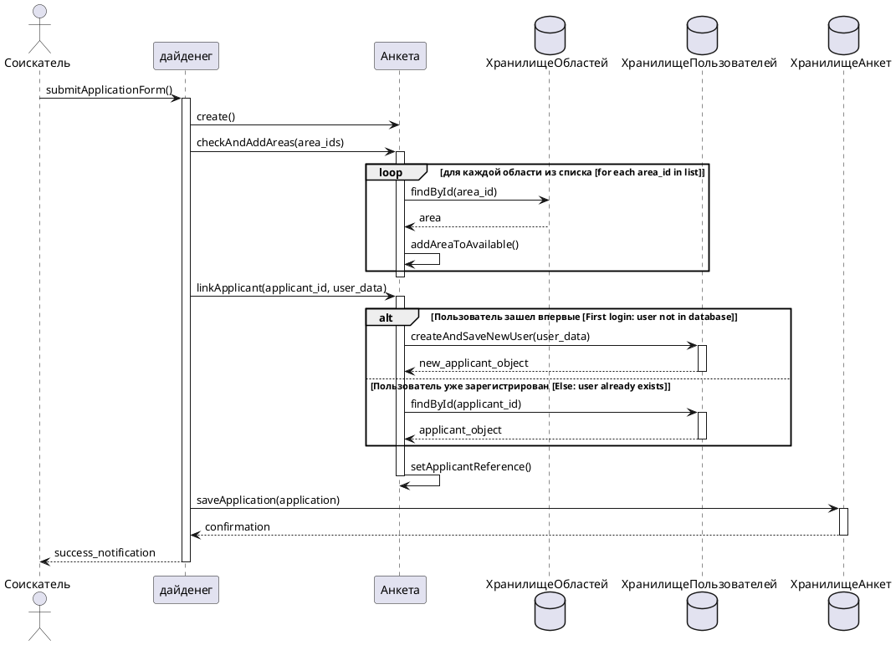

# Диаграмма последовательности "Подача заявки"

```plantuml
@startuml
skinparam responseMessageBelowArrow true

actor "Соискатель" as applicant
participant "дайденег" as system
participant "Анкета" as application
database "ХранилищеОбластей" as area_repo
database "ХранилищеПользователей" as user_repo
database "ХранилищеАнкет" as app_repo

applicant -> system : submitApplicationForm()
activate system

system -> application : create()

system -> application : checkAndAddAreas(area_ids)
activate application
loop для каждой области из списка [for each area_id in list]
    application -> area_repo : findById(area_id)
    area_repo --> application : area
    application -> application : addAreaToAvailable()
end
deactivate application

system -> application : linkApplicant(applicant_id, user_data)
activate application

alt Пользователь зашел впервые [First login: user not in database]
    application -> user_repo : createAndSaveNewUser(user_data)
    activate user_repo
    user_repo --> application : new_applicant_object
    deactivate user_repo
else Пользователь уже зарегистрирован [Else: user already exists]
    application -> user_repo : findById(applicant_id)
    activate user_repo
    user_repo --> application : applicant_object
    deactivate user_repo
end

application -> application : setApplicantReference()
deactivate application

system -> app_repo : saveApplication(application)
activate app_repo
app_repo --> system : confirmation
deactivate app_repo

system --> applicant : success_notification
deactivate system
@endum
```