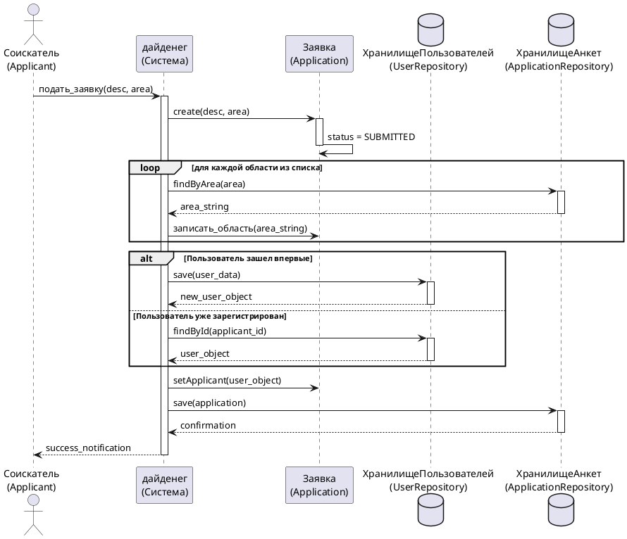

# Диаграмма последовательности "Подача заявки"

```plantuml
@startuml
skinparam responseMessageBelowArrow true

actor "Соискатель\n(Applicant)" as applicant
participant "дайденег\n(Система)" as system
participant "Заявка\n(Application)" as application
database "ХранилищеПользователей\n(UserRepository)" as user_repo
database "ХранилищеАнкет\n(ApplicationRepository)" as app_repo

applicant -> system : подать_заявку(desc, area)
activate system

system -> application : create(desc, area)
activate application
application -> application : status = SUBMITTED
deactivate application

loop для каждой области из списка
    system -> app_repo : findByArea(area)
    activate app_repo
    app_repo --> system : area_string
    deactivate app_repo
    system -> application : записать_область(area_string)
end

alt Пользователь зашел впервые
    system -> user_repo : save(user_data)
    activate user_repo
    user_repo --> system : new_user_object
    deactivate user_repo
else Пользователь уже зарегистрирован
    system -> user_repo : findById(applicant_id)
    activate user_repo
    user_repo --> system : user_object
    deactivate user_repo
end

system -> application : setApplicant(user_object)

system -> app_repo : save(application)
activate app_repo
app_repo --> system : confirmation
deactivate app_repo

system --> applicant : success_notification
deactivate system
@endum
```