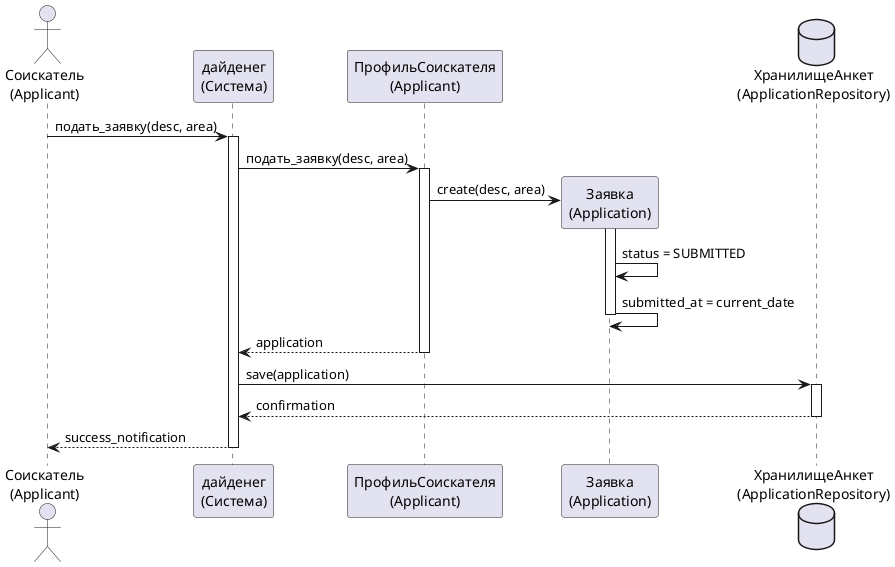

# Диаграмма последовательности "Подача заявки"

```plantuml
@startuml
skinparam responseMessageBelowArrow true

actor "Соискатель\n(Applicant)" as user_actor
participant "дайденег\n(Система)" as system
participant "ПрофильСоискателя\n(Applicant)" as applicant
participant "Заявка\n(Application)" as application
database "ХранилищеАнкет\n(ApplicationRepository)" as app_repo

user_actor -> system : подать_заявку(desc, area)
activate system

system -> applicant : подать_заявку(desc, area)
activate applicant

applicant -> application ** : create(desc, area)
activate application
application -> application : status = SUBMITTED
application -> application : submitted_at = current_date
deactivate application

applicant --> system : application
deactivate applicant

system -> app_repo : save(application)
activate app_repo
app_repo --> system : confirmation
deactivate app_repo

system --> user_actor : success_notification
deactivate system
@endum
```