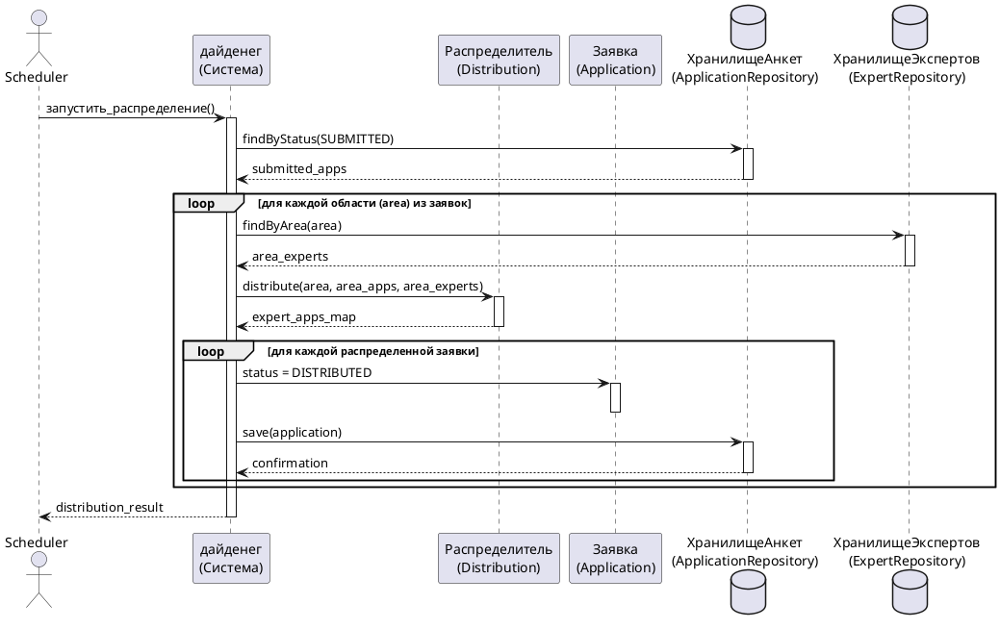

```plantuml
@startuml
skinparam responseMessageBelowArrow true

actor "Scheduler" as timer
participant "дайденег\n(Система)" as system
participant "Распределитель\n(Distribution)" as dist
participant "Заявка\n(Application)" as application
database "ХранилищеАнкет\n(ApplicationRepository)" as app_repo
database "ХранилищеЭкспертов\n(ExpertRepository)" as exp_repo

timer -> system : запустить_распределение()
activate system

system -> app_repo : findByStatus(SUBMITTED)
activate app_repo
app_repo --> system : submitted_apps
deactivate app_repo

loop для каждой области (area) из заявок
    system -> exp_repo : findByArea(area)
    activate exp_repo
    exp_repo --> system : area_experts
    deactivate exp_repo

    system -> dist : distribute(area, area_apps, area_experts)
    activate dist
    dist --> system : expert_apps_map
    deactivate dist

    loop для каждой распределенной заявки
        system -> application : status = DISTRIBUTED
        activate application
        deactivate application

        system -> app_repo : save(application)
        activate app_repo
        app_repo --> system : confirmation
        deactivate app_repo
    end
end

system --> timer : distribution_result
deactivate system
@enduml
```
