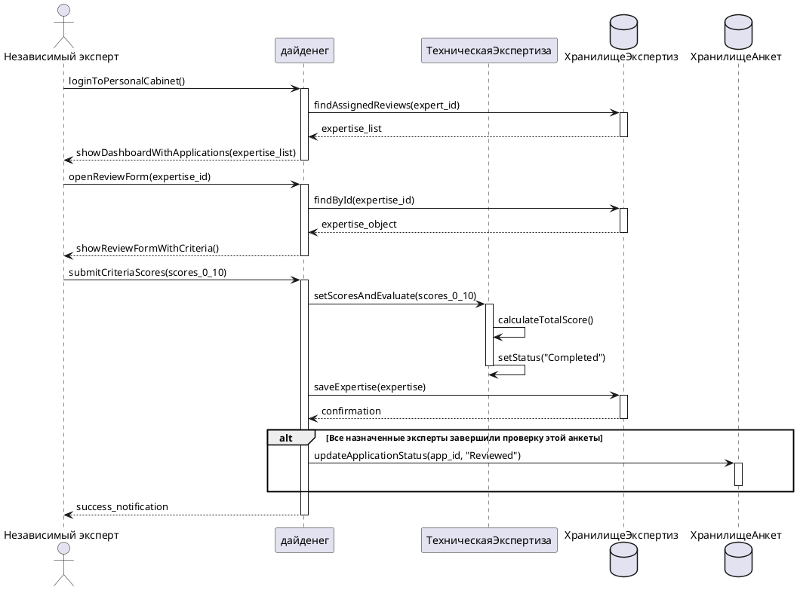

# Диаграмма последовательности Техническая экспертиза

```plantuml
@startuml
skinparam responseMessageBelowArrow true

actor "Независимый эксперт" as expert
participant "дайденег" as system
participant "ТехническаяЭкспертиза" as expertise
database "ХранилищеЭкспертиз" as exp_repo
database "ХранилищеАнкет" as app_repo

expert -> system : loginToPersonalCabinet()
activate system

system -> exp_repo : findAssignedReviews(expert_id)
activate exp_repo
exp_repo --> system : expertise_list
deactivate exp_repo

system --> expert : showDashboardWithApplications(expertise_list)
deactivate system

expert -> system : openReviewForm(expertise_id)
activate system

system -> exp_repo : findById(expertise_id)
activate exp_repo
exp_repo --> system : expertise_object
deactivate exp_repo

system --> expert : showReviewFormWithCriteria()
deactivate system

expert -> system : submitCriteriaScores(scores_0_10)
activate system

system -> expertise : setScoresAndEvaluate(scores_0_10)
activate expertise
expertise -> expertise : calculateTotalScore()
expertise -> expertise : setStatus("Completed")
deactivate expertise

system -> exp_repo : saveExpertise(expertise)
activate exp_repo
exp_repo --> system : confirmation
deactivate exp_repo

alt Все назначенные эксперты завершили проверку этой анкеты
    system -> app_repo : updateApplicationStatus(app_id, "Reviewed")
    activate app_repo
    deactivate app_repo
end

system --> expert : success_notification
deactivate system
@endum
```
