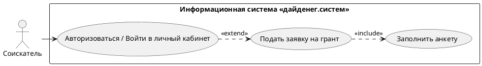

# Диаграмма прецедентов "Подача заявки"

```plantuml
@startuml
skinparam packageStyle rectangle
skinparam ranksep 20
skinparam nodesep 10

actor "Соискатель" as Applicant

rectangle "Информационная система «дайденег.систем»" {
  usecase "Авторизоваться / Войти в личный кабинет" as UC_Auth
  usecase "Подать заявку на грант" as UC_Submit
  usecase "Заполнить анкету" as UC_Fill
}

Applicant -> UC_Auth
UC_Auth .right.> UC_Submit : <<extend>>
UC_Submit .right.> UC_Fill : <<include>>

@endum
```