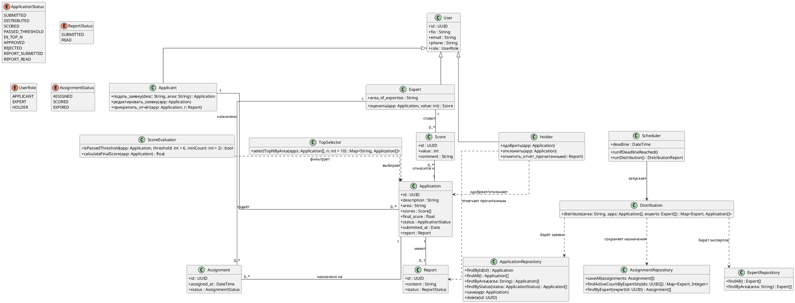

```plantuml
@startuml
skinparam classAttributeIconSize 0
hide empty members
skinparam linetype ortho
skinparam nodesep 50
skinparam ranksep 70

enum ApplicationStatus {
  SUBMITTED
  DISTRIBUTED
  SCORED
  PASSED_THRESHOLD
  IN_TOP_N
  APPROVED
  REJECTED
  REPORT_SUBMITTED
  REPORT_READ
}

enum ReportStatus {
  SUBMITTED
  READ
}

enum UserRole {
  APPLICANT
  EXPERT
  HOLDER
}

enum AssignmentStatus {
  ASSIGNED
  SCORED
  EXPIRED
}

class User {
  + id : UUID
  + fio : String
  + email : String
  + phone : String
  + role : UserRole
}

class Applicant {
  + подать_заявку(desc: String, area: String) : Application
  + редактировать_заявку(app: Application)
  + прикрепить_отчёт(app: Application, r: Report)
}

class Expert {
  + area_of_expertise : String
  + оценить(app: Application, value: int) : Score
}

class Holder {
  + одобрить(app: Application)
  + отклонить(app: Application)
  + отметить_отчёт_прочитанным(r: Report)
}

class Application {
  + id : UUID
  + description : String
  + area : String
  + scores : Score[]
  + final_score : float
  + status : ApplicationStatus
  + submitted_at : Date
  + report : Report
}

class Score {
  + id : UUID
  + value : int
  + comment : String
}

class Report {
  + id : UUID
  + content : String
  + status : ReportStatus
}

class ApplicationRepository {
  + findById(id) : Application
  + findAll() : Application[]
  + findByArea(area: String) : Application[]
  + findByStatus(status: ApplicationStatus) : Application[]
  + save(app: Application)
  + delete(id: UUID)
}

class ExpertRepository {
  + findAll() : Expert[]
  + findByArea(area: String) : Expert[]
}

class AssignmentRepository {
  + saveAll(assignments: Assignment[])
  + findActiveCountByExpertIds(ids: UUID[]) : Map<Expert, Integer>
  + findByExpert(expertId: UUID) : Assignment[]
}

class Distribution {
  + distribute(area: String, apps: Application[], experts: Expert[]) : Map<Expert, Application[]>
}

class ScoreEvaluator {
  + isPassedThreshold(app: Application, threshold: int = 6, minCount: int = 2) : bool
  + calculateFinalScore(app: Application) : float
}

class TopSelector {
  + selectTopNByArea(apps: Application[], n: int = 10) : Map<String, Application[]>
}

class Scheduler {
  + deadline : DateTime
  + runIfDeadlineReached()
  + runDistribution() : DistributionReport
}

class Assignment {
  + id : UUID
  + assigned_at : DateTime
  + status : AssignmentStatus
}

User <|-- Applicant
User <|-- Expert
User <|-- Holder

Applicant "1" -- "0..*" Application : подаёт
Expert "1" -- "0..*" Score : ставит
Score "0..*" -- "1" Application : относится к
Application "1" -- "0..1" Report : имеет

Expert "1" -- "0..*" Assignment : назначено
Application "1" -- "0..*" Assignment : назначено на

Scheduler --> Distribution : запускает
Distribution ..> AssignmentRepository : сохраняет назначения

Distribution ..> ApplicationRepository : берёт заявки
Distribution ..> ExpertRepository : берёт экспертов

ScoreEvaluator ..> Application : фильтрует
TopSelector ..> Application : выбирает

Holder ..> Application : одобряет/отклоняет
Holder ..> Report : отмечает прочитанным

User -[hidden]down- Application
Application -[hidden]down- ApplicationRepository
@enduml
```
