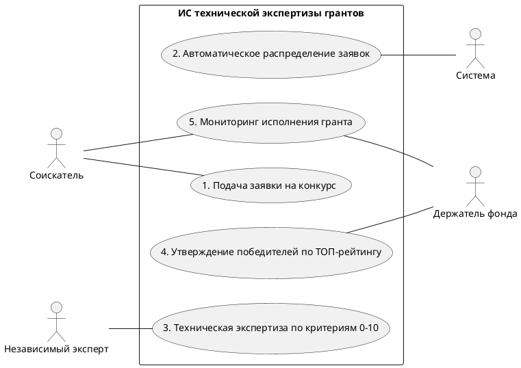

#Диаграмма прецедентов

```plantuml
@startuml
skinparam packageStyle rect
left to right direction

:Соискатель: as applicant
:Независимый эксперт: as expert

:Держатель фонда: as manager
:Система: as system

package "ИС технической экспертизы грантов" {
  
  (1. Подача заявки на конкурс) as submit
  (2. Автоматическое распределение заявок) as auto_assign
  (3. Техническая экспертиза по критериям 0-10) as review
  (4. Утверждение победителей по ТОП-рейтингу) as approve
  (5. Мониторинг исполнения гранта) as monitoring
}

applicant -- submit
applicant -- monitoring
expert -- review

auto_assign -- system
approve -- manager
monitoring -- manager

@endum
```
