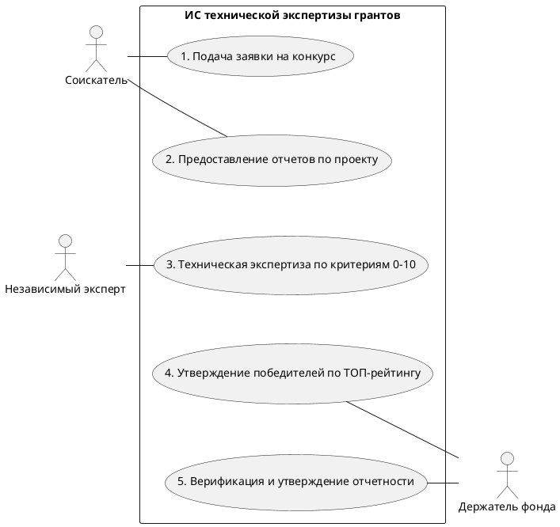

#Диаграмма прецедентов

```plantuml
@startuml
skinparam packageStyle rect

package "ИС технической экспертизы грантов" {
  (1. Подача заявки на конкурс) as submit
  (2. Предоставление отчетов по проекту) as reports_submit
  (3. Техническая экспертиза по критериям 0-10) as review
  (4. Утверждение победителей по ТОП-рейтингу) as approve
  (5. Верификация и утверждение отчетности) as reports_check

  submit -down[hidden]-> reports_submit
  reports_submit -down[hidden]-> review
  review -down[hidden]-> approve
  approve -down[hidden]-> reports_check
}

:Соискатель: as applicant
:Независимый эксперт: as expert
:Держатель фонда: as manager

submit -left-- applicant
reports_submit -left-- applicant

review -left-- expert

approve -right-- manager
reports_check -right-- manager

@endum
```
